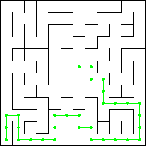
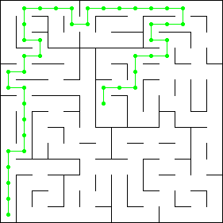
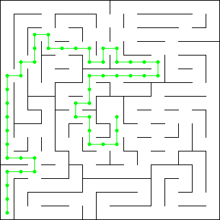
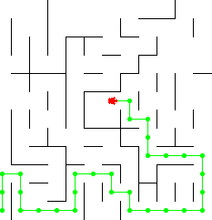

# Capstone Project
## Machine Learning Engineer Nanodegree
Terence So
October 02, 2016

## I. Definition

### Project Overview

This project is a simulation of a [Micromouse](https://en.wikipedia.org/wiki/Micromouse) competition. A robot mouse is tasked with plotting a path from a corner of the maze to its center. The robot mouse may make multiple runs in a given maze. In the first run, the robot mouse tries to map out the maze to not only find the center, but also figure out the best paths to the center. In the subsequent run, the robot mouse attempts to reach the center in the fastest time possible using what it has previously learned. This [video]( https://www.youtube.com/watch?v=0JCsRpcrk3s) is an example of a Micromouse competition.

### Problem Statement

#### Game Mechanics

The robot is given two(2) runs. It begins on the lower left corner (0,0) facing north and attempts to reach the goal room in the center of the maze. In both runs, it is required to reach the goal within 1000 turns/time steps. However, the first run is considered an “exploration run” and the robot is allowed to further explore the maze after it reaches the goal. The robot is scored based on the number of turns it takes during each run. In the exploration run, each turn is worth 1/30 points. In the second run, it is worth a full(1) point. A lower score is better.

#### The Challenge

The objective of this project is to minimize turns taken by the robot to navigate from start to goal. In the ideal case, the robot should always take the shortest path and use optimal moves every run. However, the robot has no prior knowledge of the maze and the shortest path is unknown. Therefore, our task is threefold:

1. Reveal enough of the maze to determine the shortest path from start to goal.
2. Navigate the robot using the shortest path.
3. Use the minimal number of turns while doing (1) and (2).

### Metrics

In this project, our main performance metric is already provided – a score which is a total of 1/30th of the turns taken in the first run and the number of turns taken in the second.

We shall also be using supplementary metrics to further evaluate our robot's performance – the number of steps of the chosen path and the number of turns used. Note the difference between a step and a turn: a move from one cell to an adjacent cell is considered one step; a turn can consist of a maximum of 3 steps.

## II. Analysis

### Data Exploration and Visualization

#### The Robot

The robot has sensors on the front, left and right. Each turn, each sensor returns the distance to the wall it is facing. The sensors are accurate and contain no noise.

Each turn the robot is allowed to turn left or right but not a full u-turn. It is also allowed to move forward, left, right or reverse up to a maximum of 3 steps from its current position. All turns and moves are exact and contain no noise.

Naturally, the robot cannot move through walls. If it attempts to do so, it will remain in the last valid position no feedback is provided to the robot.

#### The Mazes

There are three(3) test mazes provided. Each maze is an NxN grid where N is even from 12 to 16. Each maze's outer perimeter is completely bounded. The goal room is always a 2x2 grid in the center of the maze. There is always at least one(1) path from the starting location to the goal room. It is also worth noting that there is always a right wall at the starting location and the robot has no choice but to move forward during its first turn.

The following are diagrams of the test mazes. The shortest path is traced in each maze. There are actually multiple shortest paths with equal length, only one is shown for clarity.

##### Test Maze 01

Size: 12x12  
Shortest Path Length: 30



##### Test Maze 02

Size: 14x14  
Shortest Path Length: 43



##### Test Maze 03

Size: 16x16  
Shortest Path Length: 49



### Algorithms and Techniques

#### Finding the Goal Room

It is apparent from our data analysis that once we have the full map of the maze, it is relatively straightforward to find a path to the goal. In fact, we can do it manually by inspection and some trial and error. Algorithmically, there are several ways to do [path finding](https://en.wikipedia.org/wiki/Pathfinding): Dijkstra's, Sample and A\* search. All these algorithms achieve the same thing and are actually not very different procedurally. All these algorithms explore a tree-like structure, visiting each node until the shortest path is found.  The main difference is efficiency. In this sense, A\* tends to do better since it uses a heuristic to explore nodes that are closer to the goal first. For this project, we shall use A\*. This solves the first half of our problem.

The other half is that we do not have a map of the maze at the start of the first run. The good news is that we can build this map piecemeal from the data coming in from the robot sensors. We can first assume a maze that has no walls save for its outer perimeter and place walls as we detect them. Combining this with A\*, we find that it solves our problem rather neatly.

We can imagine the behavior of our robot with A\* when first placed in the starting location. The maze will start out void of walls, its first route will be to simply head straight north and then right towards the goal. However, things don't go according to plan. Every turn, its sensors will pick up new walls and obstacles along its route. The robot will have to come up with a new route each time the map is updated. Eventually though, it will find an opening that will take it to the goal room. The nice thing about A\* is that robot will always try to move towards the center.

#### Finding the Shortest Path

Now that we can find our way to the goal room, our next concern is to do it in the shortest time possible. We recall that our robot plans optimistically and we can make this work in our favor. When the robot first reaches the goal, the path it took to get there is likely not the shortest. However, the robot will have revealed walls and updated its map accordingly. If we make the robot run back to the start location it will mostly likely choose a different path back – one that runs through unexplored areas of the map since it thinks it will have fewer obstacles that way. By making the robot take multiple trips from the starting location to the goal room, more and more of the map will be revealed as long as the robot thinks that there are possible shorter routes worth exploring. Eventually, the robot will settle on the same route - *this* is our shortest path.

#### Robot Movement

It is important to mention that running into a wall is an extremely undesirable case. While feedback is provided to the UI, it is not provided to the robot. The robot is only given the starting position and sensor information. There is no other way to determine its position in the maze aside from tracking its own moves. If the robot hits a wall, it will fail to localize from then on. Assuming that our charting is accurate and we never instruct the robot to go past obstacles, this should never happen.

There is also the matter of maximizing the use of turns in each time step. The robot can move a maximum of three(3) steps in one direction each turn. We can take advantage of this if our A* route  has three(3) or more consecutive steps in the same direction.

### Benchmark

In the ideal case, the robot takes the shortest path using max three(3) steps per turn in both runs. The scores in this case are as follows:

| | Maze 01 |Maze 02 | Maze 03 |
| - | :-: | :-: | :-: |
| Size | 12x12 | 14x14 | 16x16 |
| Path Length | 30 | 43 | 49 |
| Turns | 17 | 28 | 29 |
| Score | 17.567 | 28.934 | 29.967 |

While it is unrealistic to expect that we can achieve these scores, it is reasonable to expect to at least be able to find the shortest path. Additionally, the robot should be able to maximize movement and use the minimum amount of turns following the said path. This shall be our minimum baseline performance.

## III. Methodology

### Data Preprocessing

No data preprocessing is necessary in this project. All input map data and sensor data is valid and accurate.

### Implementation

#### Conventions

In an effort to standardize the representation of heading and orientation, the following table displays the conventions used in this implementation.

| Heading | Index | Angle | Delta |
| :-: | :-: | :-: | :-: |
| N | 0 | 0 | [ 0,  1] |
| E | 1 | 90 | [ 1,  0] |
| S | 2 | 180 | [ 0, -1] |
| W | 3 | 270 | [-1,  0] |

This is implemented in code with an array named delta:

``` python
delta = [[ 0,  1], # up
         [ 1,  0], # right
         [ 0, -1], # down
         [-1,  0]] # left
```

#### Maze Class

The Maze class is an encapsulation of the structure of a maze. Internally, it is backed using a 2-D numpy int array. Each element in the array represents a cell. The first dimension is the horizontal x-axis. The second dimension represents the vertical y-axis. The 4-bits of each element indicates whether a wall exists on each side of the cell. If a wall exists, the bit is 0. Otherwise, it is 1. This representation is consistent with the provided test mazes.

| Orientation | N | E | S | W |
| - | - | - | - |
| bit | 0 | 1 | 2 | 3 |

A fully loaded Test Maze 01 looks like the following figure. At [0, 0] the value is 1, which means only the north side is open.

```python
[[ 1  5  7  5  5  5  7  5  7  5  5  6]
 [ 3  5 14  3  7  5 15  4  9  5  7 12]
 [11  6 10 10  9  7 13  6  3  5 13  4]
 [10  9 13 12  3 13  5 12  9  5  7  6]
 [ 9  5  6  3 15  5  5  7  7  4 10 10]
 [ 3  5 15 14 10  3  6 10 11  6 10 10]
 [ 9  7 12 11 12  9 14  9 14 11 13 14]
 [ 3 13  5 12  2  3 13  6  9 14  3 14]
 [11  4  1  7 15 13  7 13  6  9 14 10]
 [11  5  6 10  9  7 13  5 15  7 14  8]
 [11  5 12 10  2  9  5  6 10  8  9  6]
 [ 9  5  5 13 13  5  5 12  9  5  5 12]]
 ```

This class is generally used to determine whether a location is within the maze ```bounds()```, determining whether a particular side of a cell is ```passable()```, and used to ```block_cell()``` sides.

#### AStarPlanner Class

This class is an implementation the [A\* search algorithm](https://en.wikipedia.org/wiki/A*_search_algorithm). It uses a euclidean distance to the center of the maze as a ```heuristic()```. Using a maze, start and goal locations, the function ```plan()``` runs A\* and returns a route.

```python
def plan(self):
    '''
    Do A* search. Return an optimal route.
    '''
    x, y = self.start
    opened = [(self.heuristic(x, y), 0, x, y)]
    closed = np.full(self.map.shape(), -1, dtype=np.int)
    closed[x][y] = 0
    route = None
    while len(opened) > 0:
        opened.sort()
        f, g, x, y  = opened.pop(0)
        if (x, y) in self.goal:
            # We've found the goal. Backtrace a route to the starting location
            route = []
            step = closed[x][y]
            i = 0
            while step != 0:
                while True:
                    x2 = x - delta[i][0]
                    y2 = y - delta[i][1]
                    if self.map.passable(x2, y2, i) and closed[x2][y2] == step-1:
                        # check if our planner went through this cell and if it was the previous step
                        route.append(i)
                        step -= 1
                        x = x2
                        y = y2
                        break
                    else:
                        i = (i + 1) % 4
            route.reverse()
            break
        else:
            for i in range(len(delta)):
                x2 = x + delta[i][0]
                y2 = y + delta[i][1]
                if self.map.passable(x, y, i) and closed[x2][y2] < 0:
                    # passable and we haven't covered this location before
                    g2 = g + self.cost
                    f2 = g2 + self.heuristic(x2, y2)
                    opened.append([f2, g2, x2, y2])
                    closed[x2][y2] = g2
    # print closed
    self.closed = closed
    return route
```

The route is an array of steps to reach the goal. Each element is one of four(4) directions: N, S, E and W as per our convention. The route for Test Maze 01 is as follows.

``` python
[0, 0, 1, 2, 2, 1, 1, 1, 0, 0, 1, 1, 2, 1, 2, 1, 1, 1, 1, 0, 0, 0, 3, 3, 3, 0, 0, 3, 0, 3]
```

#### Robot Class

This class is the meat of our implementation. It uses the maze and planner classes to determine the correct move at each time step. Moreover, it controls meta-planning - setting start and goal locations during exploration and when to reset for the test run.

The section of the code that turns the route into rotation and movement at each time step is worth discussing:

```python
# turn right by default when a u-turn is needed
rotations = [0, 1, -1, -1]
movements = [1, 1, 0,  1]
h = (self.route[self.route_i] - self.heading + 4) % 4
rotation = rotations[h]
movement = movements[h]
if movement > 0:
    self.route_i += 1
    # maximize movement
    while self.route_i < len(self.route) and \
        self.route[self.route_i] == self.route[self.route_i-1] and \
        movement < 3:
            self.route_i += 1
            movement += 1
self.move(rotation, movement)
rotation *= 90
self.steps += movement
```

The first part of this code snippet determines the appropriate rotation and movement for the given step in the route plus the robot's current heading. Note that we never make the robot go in reverse. Going in reverse is risky business, as we are never really sure that our map is already complete, and running into a wall will completely tilt our localization. There is likely a way to handle this elegantly, but u-turns are rare and only happen during exploration (since we already have an optimal route when we go into the test run, and optimal routes have no u-turns). At best we shave a point off the final score, but it hardly seems worth the extra code.

The next part of the snippet maximizes the turn, allowing the robot to move up to a maximum of three steps. It checks the route for consecutive moves in the same direction.

#### Visualizer Class

Implemented using the turtle library, the Visualizer is a straightforward class for drawing the maze, path and robot to the screen. The following is a screenshot of the visualizer in action.



### Refinement

Our robot implementation is actually an optimistic reinforcement learning algorithm. The exploration run is the robot's training phase. During this phase, we make the robot take multiple back and forth trips from the start and goal locations. The following is code snippet from the Robot's `next_move()` function that implements this.

```python
reset = False
# update map based on sensors
# update plan if necessary
if self.update_map(sensors): # returns true if map changed
    self.update_plan()

if self.route == None:
    # No route to goal
    raise Exception('No route to goal!')
elif self.route_i < len(self.route):
    # We are still en route
    pass
else:
    # We've reached the goal
    if self.steps <= self.steps_expected:
        # Bot is ready for the actual run
        self.reset()
        reset = True
        self.practice = False
        self.flipflop = True
    # Flip flop between the start location and goal until bot is already
    # taking the optimal path from start -> goal
    elif self.flipflop:
        # make it run back to the start location
        self.planner = AStarPlanner(self.maze, self.loc, [(0, 0)])
        self.flipflop = not self.flipflop
    else:
        # make it do one more trip to the goal
        self.planner = AStarPlanner(self.maze, self.loc)
        self.flipflop = not self.flipflop
    self.update_plan()
    self.steps_expected = len(self.route)
```

Every trip the robot takes (start to goal or vice versa), the robot plots a course that seems shortest and records its expected number of steps to get to the goal. If the number of steps used exceed the expectation, it means obstacles were encountered and the robot was forced to reroute. If it does not, it means it has found the shortest path and the robot ceases the exploration run. No hyper-parameters are necessary.

## IV. Results

### Model Evaluation and Validation

The following detailed statistics were gathered from each trip of the robot.

#### Test Maze 01

| Trip | 01 | 02 | 03 | 04 | 05 | Test |
| - | -: | -: | -: | -: | -: | -: |
| Steps Expected |  - | 16 | 26 | 28 | 30 | 30 |
| Steps Used     | 44 | 44 | 32 | 32 | 30 | 30 |
| Turns Used     | 40 | 44 | 24 | 23 | 17 | 17 |

#### Test Maze 02

| Trip | 01 | 02 | 03 | 04 | 05 | Test |
| :- | -: | -: | -: | -: | -: | -: |
| Steps Expected |  - | 23 | 35 | 41 | 43 | 43 |
| Steps Used     | 81 | 53 | 51 | 45 | 43 | 43 |
| Turns Used     | 78 | 46 | 37 | 28 | 27 | 27 |

#### Test Maze 03

| Trip | 01 | 02 | 03 | 04 | 05 | Test |
| - | -: | -: | -: | -: | -: | -: |
| Steps Expected |  - | 21 | 45 | 47 | 49 | 49 |
| Steps Used     | 91 | 77 | 63 | 51 | 49 | 49 |
| Turns Used     | 76 | 63 | 39 | 30 | 30 | 29 |

#### Results Summary

| Maze | 01 | 02 | 03 |
|-|-:|-:|-:|
| Train Trips | 5 | 5 | 5 |
| Train Turns | 153 | 221 | 243 |
| Test Path Length | 30 | 43 | 49 |
| Test Turns | 17 | 27 | 29 |
| Score |22.100 | 34.367 | 37.100 |

The results are good. In every run, the robot successfully finds the goal room. In addition, the robot successfully determines the shortest path on the 5th training trip. Another observation is that steps expected gets progressively worse every trip while steps used gets progressively better. This is a sign that the robot is adjusting its expectations based on new data.

### Justification

The following table shows our results against our benchmarks.

| __Maze__ | __01__ | __01__ | __02__ | __02__ | __03__ | __03__ |
|-|-:|-:|-:|-:|-:|-:|
| | __Actual__ | __Benchmark__ | __Actual__ | __Benchmark__ | __Actual__ | __Benchmark__ |
| Path Length | 30 | 30 | 43 | 43 | 49 | 49 |
| Train Turns | 153 | 17 | 221 | 28 | 243 | 29 |
| Test Turns | 17 | 17 | 27 | 28 | 29 | 29 |
| Score | 22.100 | 17.567 | 34.367 | 28.934 | 37.100 | 29.967 |

We see that our results are very close or equal to our ideal benchmark. We also verify that we have achieved our baseline performance which is to find the shortest path and use minimal turns in the test run. There is a difference in score however, and this is caused by the number of turns used to explore the maze in the first run.

## V. Conclusion

### Free-Form Visualization
In this section, you will need to provide some form of visualization that emphasizes an important quality about the project. It is much more free-form, but should reasonably support a significant result or characteristic about the problem that you want to discuss. Questions to ask yourself when writing this section:
- _Have you visualized a relevant or important quality about the problem, dataset, input data, or results?_
- _Is the visualization thoroughly analyzed and discussed?_
- _If a plot is provided, are the axes, title, and datum clearly defined?_

### Reflection

I did this coming fresh from the Artificial Intelligence for Robotics course so I already had general idea of how to get the robot to the goal room. Getting the robot to perform well was another story and I didn't have a solution for that in the onset. I figured the best way to find out was to learn by doing, so I set out building a prototype with a few guidelines:

* build a map from sensor data
* use A\* for path finding
* move one step at a time and no reverse
* and most importantly, DON'T hit any walls

Once I was consistently getting the robot to the goal room and finishing the course without any mishaps, it was time to look at the scores and performance. During one of my tests, I observed something curious - sometimes the robot will do worse on the second run. At this point, the robot was only programmed to get to the goal room, reset, and get to the goal room again. With the help of some visualization, I discovered that the robot was always taking a different path in the second run. It was in fact trying to find a better route all by itself. This was how the back and forth trips from start to goal came to be.

After some refactoring, the only remaining bit of optimization needed was making the robot take multiple steps per turn. This was easily accomplished by counting route steps that were in the same direction.

One final thing - there was this perplexing bug where the robot would get stuck moving back and forth between the same two positions, and it took me a while to solve it. At times the planner would produce these 'mirror' routes - the first move from one position would lead to the other position, and vice versa. This can happen if the planner is run every time step. The solution was to only update the route when the map was updated, forcing the robot to 'follow through' with the original route.

### Improvement

Thinking within the confines of this simulation, the first change I would make is slap a fourth sensor facing the back of the robot. This would allow us to go in reverse without a lot more code and shave off some more points during exploration. Also something I considered and experimented on briefly is something akin to early stopping. From the results, the route used in last training run is the same one used in the test run, so it's actually superfluous. We could stop at the 4th run and save some points. One way to do this is to add an error margin - say 10%, to the training stop condition. This actually worked lowering a point on Maze 02 and 03, but seems too unreliable to include without testing on more mazes. Finally, there's the possibility of using expected turns to evaluate paths instead of steps.

If we were to work with an actual robotic mouse, adapting our implementation would depend on how reliable the hardware is. Micromouse competitions are very specific regarding wall and grid specifications. If the motor controller can guarantee movement accuracy and if a lower layer filter can give us clean sensor data, then we can pretty much use the same code for high level path planning. Basically, we abstract away the non-idealities. If that is not possible, then we may have to expand the grid size and consider that the robot and walls can occupy several cells. Collision detection will be a bit different but A\* can still work in this case, albeit with a larger grid.
